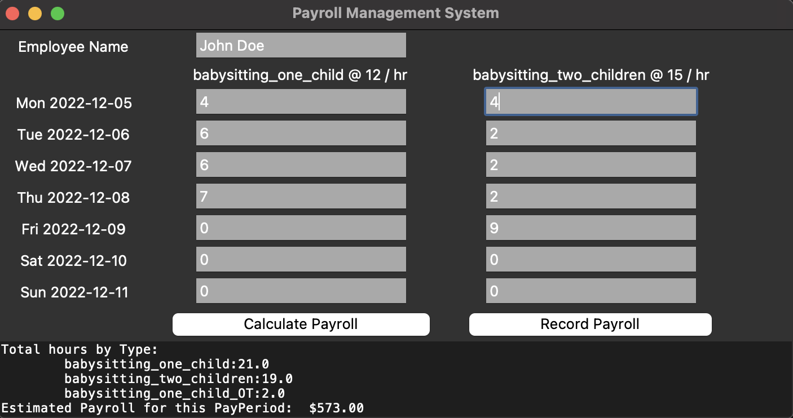

# Payroll Management
## Goal
Provide a simple way to calculate weekly hours and payrate for an employee (including overtime logic), given a number of hours worked each day.
Tool allows to distinguish several pay rates, depending on the type of service provided (e.g. 1 child vs 2 children care).
default values can be modified to avoid re-entering details every time.

## How to Install
`conda create -n payroll pip ipywidgets`
`pip install -e .`
## How to run
`python main.py --config {yml config file}`

cf. `config/example.yml` for an example of config file setup.

the above command launches a simple user interface allowing to populate the number of hours executed each day of the week by the service provider.
It can then calculate hours and paycheck (before taxes) by service type, baking in overtime.  
## GUI Example

